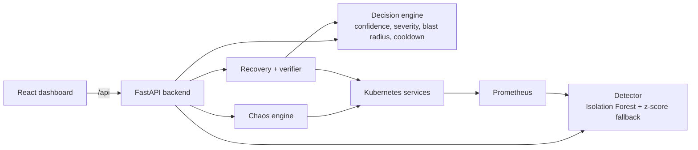

# KubeResilience

Hackathon submission for MIT-BLR Hackathon 2026: a chaos engineering and self-healing demo for Kubernetes microservices.

[](https://github.com/dptel22/MIT-HACKATHON)
[](./backend)
[](./frontend)
[](./backend/chaos)

KubeResilience is built to show a simple but compelling loop in front of judges: inject a controlled failure into a non-critical service, detect the degradation from telemetry, decide whether automated recovery is safe, restart one pod, and verify that the service stabilizes.

## Why This Exists

Modern Kubernetes demos usually stop at "the service failed." This project focuses on the next step: how a platform can safely react to failure. The target experience is a live Online Boutique style demo where non-critical services are stressed on purpose, the system spots the issue from Prometheus metrics, and the dashboard shows a visible recovery path instead of a dead-end outage.

## What It Actually Does

- Detects anomalies from Prometheus-derived metrics such as p95 latency, error rate, CPU, and memory.
- Uses a trained Isolation Forest model when artifacts are available, with a z-score fallback when they are not.
- Applies a decision layer with confidence gating, scenario classification, severity scoring, blast-radius protection, and adaptive cooldowns.
- Injects controlled chaos into supported non-critical services through the backend chaos engine.
- Restarts exactly one pod for a recoverable service and then verifies stabilization.
- Persists incident history in SQLite for demo visibility.
- Exposes a React dashboard for service health, latency windows, incidents, chaos controls, and recovery state.

## How the Demo Works

1. A user injects chaos from the dashboard, or enables auto-chaos for rotating incidents.
2. The backend marks the target service anomalous and starts a short forced-anomaly grace window so the demo remains responsive even if Prometheus updates lag.
3. The detector updates service confidence and anomaly state from live metrics.
4. The decision engine checks whether recovery is allowed for that service and scenario.
5. If the gates pass, the recovery layer restarts exactly one pod.
6. The verifier checks that the service comes back healthy and records the incident outcome.

### Demo mode vs cluster mode

- If `PROMETHEUS_URL` is not set, the backend defaults to demo mode.
- In demo mode, the repo uses shipped baseline/model artifacts, warmup is skipped by default, and chaos responses are simulated so the dashboard stays usable without a live cluster.
- In cluster mode, the backend expects a reachable Prometheus instance and a valid kubeconfig path.

## Architecture



## Supported Demo Scope

### Auto-remediable chaos targets

- `cartservice`
- `recommendationservice`
- `adservice`
- `productcatalogservice`

### Supported chaos scenarios

- `pod_kill`
- `cpu_stress`
- `network_latency`
- `memory_leak`
- `packet_loss`

### Guardrails

- `checkoutservice` is treated as a critical tracked service and is not auto-remediated.
- `frontend` and `checkoutservice` are blocked from chaos injection in the backend safety layer.
- Recovery is intentionally bounded to one pod per action.

## Repository Layout

```text
MIT-HACKATHON/
|-- backend/   FastAPI app, detector, decision engine, recovery, verifier, tests
|-- frontend/  React dashboard built with Vite
|-- docs/      PRD, implementation notes, and historical references
`-- data/      Local runtime state used during development/demo runs
```

Useful entry points:

- [backend/main.py](./backend/main.py) - API routes and runtime orchestration
- [backend/decision.py](./backend/decision.py) - recovery safety logic
- [backend/chaos/chaos_engine.py](./backend/chaos/chaos_engine.py) - chaos injection layer
- [frontend/src/App.jsx](./frontend/src/App.jsx) - main dashboard flow

## Running Locally

### 1. Clone the repo

```bash
git clone https://github.com/dptel22/MIT-HACKATHON.git
cd MIT-HACKATHON
```

### 2. Start the backend

```bash
cd backend
python -m venv .venv
source .venv/bin/activate
# Windows PowerShell: .venv\Scripts\Activate.ps1
pip install -r requirements.txt
uvicorn main:app --reload --host 0.0.0.0 --port 8000
```

### 3. Start the frontend

```bash
cd frontend
npm install
npm run dev
```

The frontend proxies `/api` requests to the backend. By default, the Vite dev server targets `http://127.0.0.1:8000`.

## Configuration

| Variable | Default | Purpose |
| --- | --- | --- |
| `PROMETHEUS_URL` | empty | Prometheus base URL. If unset, the backend falls back to demo mode by default. |
| `KUBE_NAMESPACE` | `boutique` | Namespace used for Kubernetes service and chaos operations. |
| `KUBE_CONFIG_PATH` | `backend/kubeconfig.yaml` | Kubeconfig path for recovery and verification actions. |
| `KUBERESILIENCE_DEMO_MODE` | derived from `PROMETHEUS_URL` | Explicitly forces demo mode on or off. |
| `PROMETHEUS_TIMEOUT_SECONDS` | `0.75` | Timeout for Prometheus metric requests. |
| `VITE_API_PROXY_TARGET` | `http://127.0.0.1:8000` | Frontend dev proxy target for `/api`. |

## Tech Stack

### Backend

- FastAPI
- SQLAlchemy
- Requests / HTTPX
- Kubernetes Python client
- NumPy
- Scikit-learn
- Joblib
- SQLite for demo persistence

### Frontend

- React 19
- Vite
- Recharts
- Vanilla CSS

## Honest Notes

- This is a hackathon demo project, not a production-ready resilience platform.
- The detector is not "just z-score"; the current code uses Isolation Forest artifacts when available and falls back to z-score logic when needed.
- The current "circuit breaker" is a backend safety state surfaced in the UI during recovery and cooldown. It is not a full service-mesh traffic management implementation.
- Warmup is currently skipped by default because the repo ships with precomputed baselines and model artifacts.
- Some documents under `docs/` are historical. The current codebase is the source of truth if a document and the implementation disagree.
- Local caches, logs, SQLite files, and virtual environments are development artifacts and should not be treated as source material.

## Team

Built by The Resilience Squad:

- Nitin
- Arsh
- Tanju
- Dhruv

## Additional Notes

- Historical implementation notes and references live under [docs/](./docs).
- If you want the real cluster demo path, provide a reachable Prometheus instance, a valid kubeconfig, and point the frontend/backend to the same environment.
